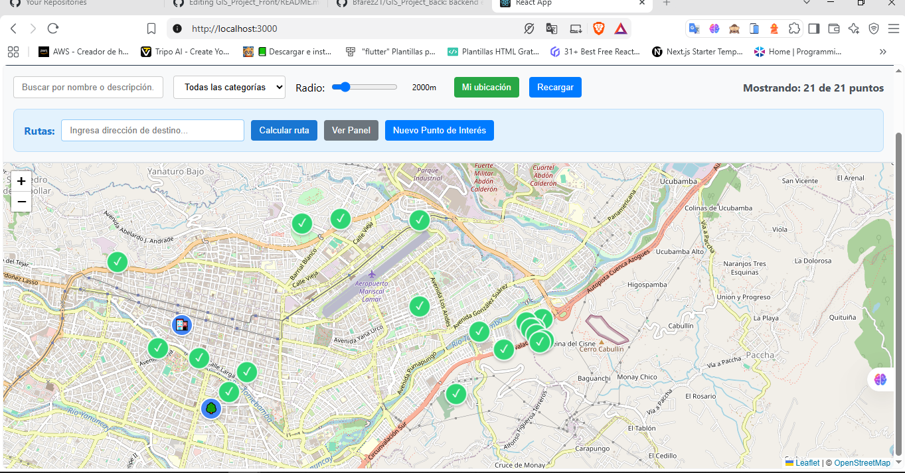
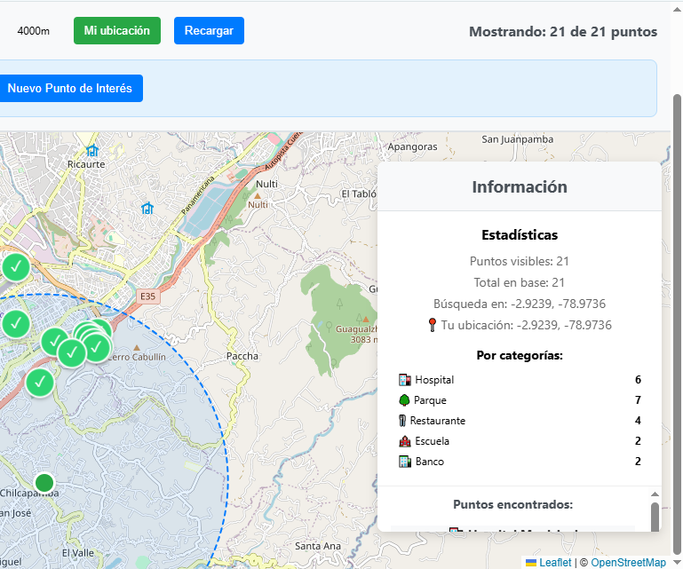
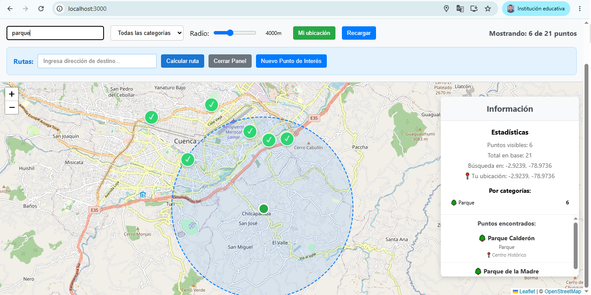
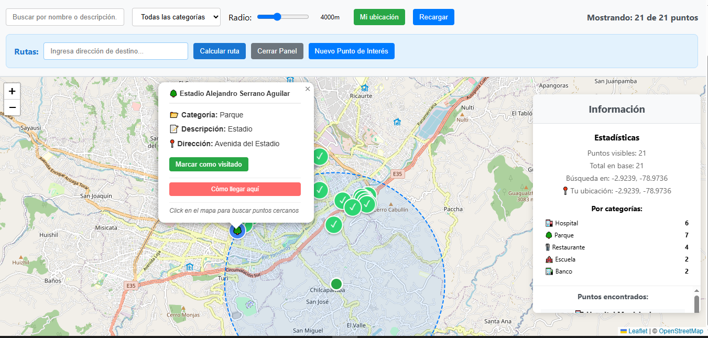

# 🗺️ GIS Project Frontend

Sistema de mapas interactivo para visualización y gestión de puntos de interés georreferenciados, desarrollado con React y Leaflet.

## 🚀 Características Principales

- ✅ **Visualización interactiva** de puntos de interés en mapa
- ✅ **Búsqueda geoespacial** por proximidad con radio ajustable
- ✅ **Filtros avanzados** por categoría y búsqueda textual
- ✅ **Geolocalización** del usuario
- ✅ **Iconos personalizados** por categoría con emojis
- ✅ **Panel de información** con estadísticas en tiempo real
- ✅ **Lista interactiva** de resultados
- ✅ **Popups informativos** con datos completos
- ✅ **Círculos de búsqueda** visuales
- ✅ **Interfaz responsive** y moderna

## 🛠️ Tecnologías Utilizadas

| Tecnología | Versión | Propósito |
|------------|---------|-----------|
| **React** | ^18.0.0 | Framework principal |
| **Leaflet** | ^1.9.0 | Mapas interactivos |
| **React-Leaflet** | ^4.0.0 | Integración React-Leaflet |
| **Axios** | ^1.0.0 | Cliente HTTP |
| **OpenStreetMap** | - | Tiles de mapas |

## 📦 Instalación

### Prerrequisitos
- Node.js >= 16.0.0
- npm >= 8.0.0
- Backend GIS funcionando en `http://localhost:8080`

### Pasos de instalación

```bash
# 1. Clonar el repositorio
git clone https://github.com/Bfarez21/GIS_Project_Front.git
cd gis-project-front

# 2. Instalar dependencias
npm install

# 3. Instalar dependencias específicas
npm install leaflet react-leaflet axios

# 4. Iniciar el servidor de desarrollo
npm start
```

## ⚙️ Configuración

### Variables de Entorno

Crear archivo `.env` en la raíz del proyecto:

```env
REACT_APP_API_BASE_URL=http://localhost:8080/api
REACT_APP_DEFAULT_LAT=-2.8990
REACT_APP_DEFAULT_LNG=-78.9680
REACT_APP_DEFAULT_ZOOM=13
```

### Configuración de la API

En `MapComponent.js`, verificar la URL base:

```javascript
const API_BASE_URL = process.env.REACT_APP_API_BASE_URL || 'http://localhost:8080/api';
```

## 🎯 Funcionalidades Detalladas

### 1. 🗺️ **Mapa Principal**
- **Proveedor**: OpenStreetMap
- **Centro inicial**: Cuenca, Ecuador (-2.8990, -78.9680)
- **Zoom inicial**: 13
- **Interactividad**: Click para búsqueda por proximidad

### 2. 🔍 **Sistema de Búsqueda**

#### Búsqueda Textual
- **Campo de entrada**: Busca en nombre y descripción
- **Filtrado en tiempo real**: Sin necesidad de botón enviar
- **Insensible a mayúsculas**: Búsqueda case-insensitive

```javascript
// Implementación
const buscarPorTexto = (texto) => {
  setBusquedaTexto(texto);
};
```

#### Búsqueda por Proximidad
- **Activación**: Click en cualquier punto del mapa
- **Radio ajustable**: 500m - 10km
- **Visualización**: Círculo azul punteado
- **Integración**: Combina con filtros de categoría

### 3. 🎛️ **Panel de Controles**

| Control | Función | Ubicación |
|---------|---------|-----------|
| **Campo búsqueda** | Filtro textual | Superior izquierda |
| **Selector categoría** | Filtro por tipo | Centro |
| **Slider radio** | Ajuste distancia | Centro-derecha |
| **Mi ubicación** | Geolocalización | Derecha |
| **Recargar** | Actualizar datos | Derecha |
| **Toggle panel** | Mostrar/ocultar info | Extremo derecha |

### 4. 📊 **Panel de Información Lateral**

#### Estadísticas en Tiempo Real
- Puntos totales vs. filtrados
- Coordenadas de última búsqueda
- Distribución por categorías
- Contador dinámico

#### Lista de Resultados
- **Límite**: Muestra primeros 10 puntos
- **Interactividad**: Click para centrar mapa
- **Información**: Nombre, categoría, dirección
- **Indicador**: "... y X más" si hay más resultados

### 5. 🎨 **Sistema de Iconos**

```javascript
const iconosPorCategoria = {
  'Restaurante': '🍴',
  'Hospital': '🏥', 
  'Escuela': '🏫',
  'Parque': '🌳',
  'Banco': '🏦'
};
```

#### Características de Iconos
- **Diseño**: Círculos azules con emoji
- **Tamaño**: 30x30 pixels
- **Efectos**: Borde blanco y sombra
- **Fallback**: 📍 para categorías sin emoji

### 6. 📍 **Marcadores Especiales**

#### Ubicación del Usuario
- **Color**: Verde (#28a745)
- **Tamaño**: 20x20 pixels
- **Activación**: Botón "Mi ubicación"
- **Permisos**: Solicita geolocalización del navegador

#### Círculo de Búsqueda
- **Color**: Azul (#007bff)
- **Estilo**: Línea punteada
- **Transparencia**: 10% de relleno
- **Actualización**: Automática con cambio de radio

### 7. 💬 **Popups Informativos**

#### Contenido Completo
- **Título**: Emoji + nombre del lugar
- **Campos disponibles**:
  - 📂 Categoría
  - 📝 Descripción  
  - 📍 Dirección
  - 📞 Teléfono (clickeable)
  - ✉️ Email (clickeable)
  - 🌐 Website (enlace externo)

#### Características Técnicas
- **Ancho máximo**: 300px
- **Ancho mínimo**: 250px
- **Links funcionales**: Tel, mailto, web
- **Estilo**: Organizado con iconos

## 📁 Estructura del Proyecto


## 🔗 API Endpoints

### Endpoints Utilizados

| Método | Endpoint | Propósito | Parámetros |
|--------|----------|-----------|------------|
| `GET` | `/api/puntos` | Obtener todos los puntos | - |
| `GET` | `/api/puntos/categorias` | Obtener categorías | - |
| `GET` | `/api/puntos/cercanos` | Búsqueda por proximidad | lat, lng, radio, categoria |
| `GET` | `/api/puntos/{id}` | Obtener punto específico | id |

### Formato de Respuesta

```json
{
  "id": 1,
  "nombre": "Hospital del Río",
  "descripcion": "Centro médico especializado",
  "categoria": "Hospital",
  "direccion": "Av. 12 de Abril y Solano",
  "telefono": "07-2842000",
  "email": "info@hospitalrio.com",
  "website": "https://hospitalrio.com",
  "latitud": -2.8956,
  "longitud": -78.9845,
  "activo": true,
  "fechaCreacion": "2024-01-15T10:30:00"
}
```

## 🎮 Uso de la Aplicación

### Flujo Básico de Usuario

1. **Carga inicial**: La app muestra todos los puntos activos
2. **Exploración**: Navegar por el mapa arrastrando/zoom
3. **Filtrado**: Usar controles superiores para filtrar
4. **Búsqueda espacial**: Click en mapa para buscar por área
5. **Detalles**: Click en marcadores para ver información
6. **Navegación**: Usar panel lateral para saltar entre puntos

### Casos de Uso Principales

#### 🔍 Encontrar servicios cercanos
1. Click en "Mi ubicación"
2. Ajustar radio de búsqueda
3. Seleccionar categoría específica
4. Revisar resultados en panel lateral

#### 🏥 Buscar tipo específico de lugar
1. Seleccionar categoría en dropdown  
2. Usar búsqueda textual si es necesario
3. Revisar contador de resultados
4. Explorar lista en panel lateral

#### 📍 Explorar área específica
1. Navegar a zona de interés
2. Click en punto del mapa
3. Ajustar radio según necesidad
4. Analizar distribución en estadísticas

## 📸 Capturas de Pantalla
...

| Vista General & Marcadores | Panel Lateral de Estadísticas |
| :---: | :---: |
|  |  |

| Búsqueda por Proximidad | Popup Informativo de POI |
| :---: | :---: |
|  |  |
...
## 🎨 Personalización

### Cambiar Iconos

```javascript
// En MapComponent.js
const iconosPorCategoria = {
  'TuCategoria': '🎯',  // Agregar nuevo emoji
  'OtraCategoria': '⭐'
};
```

### Modificar Colores

```javascript
// Colores del tema
const colores = {
  primario: '#007bff',    // Azul principal
  exito: '#28a745',       // Verde usuario
  fondo: '#f8f9fa',       // Gris claro
  borde: '#dee2e6'        // Gris borde
};
```

### Ajustar Configuración de Mapa

```javascript
// Centro y zoom iniciales
const centro = [-2.8990, -78.9680];  // Cuenca, Ecuador
const zoomInicial = 13;

// Límites de radio de búsqueda
const radioMin = 500;    // 500 metros
const radioMax = 10000;  // 10 kilómetros
```

## 🐛 Solución de Problemas

### Problemas Comunes

#### 1. **Iconos de Leaflet no se muestran**
```javascript
// Solución ya implementada
delete L.Icon.Default.prototype._getIconUrl;
L.Icon.Default.mergeOptions({
  iconRetinaUrl: 'https://cdnjs.cloudflare.com/ajax/libs/leaflet/1.7.1/images/marker-icon-2x.png',
  // ... resto de configuración
});
```

#### 2. **Error de CORS**
- Verificar que el backend tenga CORS habilitado
- Comprobar URL de la API en configuración
- Usar proxy en development si es necesario

#### 3. **Geolocalización no funciona**
- Verificar que el sitio se sirva por HTTPS (producción)
- Comprobar permisos del navegador
- Manejar caso cuando usuario rechaza permisos

#### 4. **Mapa no carga**
- Verificar conexión a internet
- Comprobar que tiles de OSM estén disponibles
- Revisar consola por errores de JavaScript

### Logs y Debugging

```javascript
// Activar logs detallados
console.log('Puntos cargados:', puntos);
console.log('Filtros aplicados:', { filtroCategoria, busquedaTexto });
console.log('Punto de búsqueda:', puntoClick);
```
---

### Versión 1.0.0 (Actual)
- ✅ Implementación inicial del mapa
- ✅ Sistema de búsqueda por proximidad
- ✅ Filtros por categoría y texto
- ✅ Panel de información lateral
- ✅ Iconos personalizados
- ✅ Geolocalización del usuario
- ✅ Interfaz responsive

---
## 🔗 Repositorios del Ecosistema GIS

* 💻 **Frontend Web:** [GIS_Project_Front](https://github.com/Bfarez21/GIS_Project_Front)
* ⚙️ **Backend API:** [GIS_Project_Back](https://github.com/Bfarez21/GIS_Project_Back)
